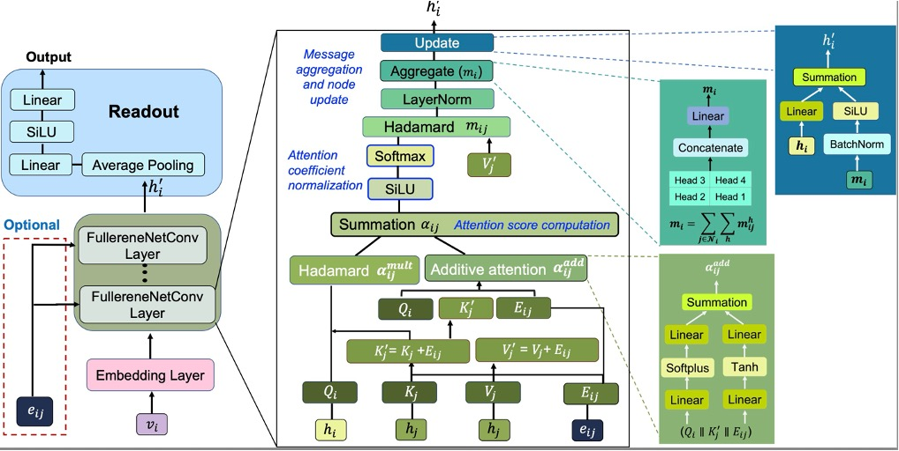
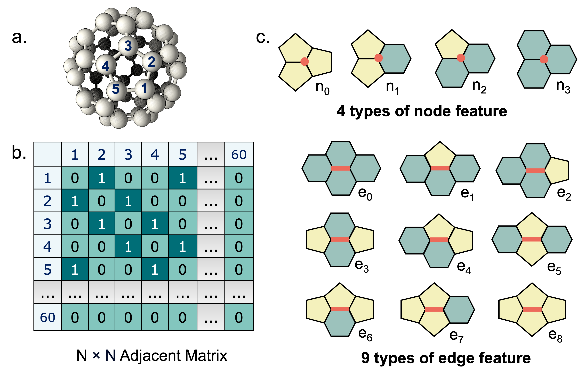

# FullereneNet
[Extrapolating Beyond C60: Advancing Prediction of Fullerene Isomers with FullereneNet](https://chemrxiv.org/engage/chemrxiv/article-details/68614e6ec1cb1ecda01b3421) 

**Model** 


**Feature**


## Dependency
```python
pip install torch
pip install torch-geometric
pip install rdkit
pip install scikit-learn
pip install pandas matplotlib
pip install tqdm 
```

## Feature Generation 
Before training, generate the features by running:
``` bash
python feature/generate_all_features.py
```

## Data Split Strategy
We provide several data split strategies for training and evaluation:
1. **Random split**

    Specify the seed when running training:
    ```bash
    python train_and_test_FullereneNet.py --seed 0
    ```
2. **Random split**

    See `split_method/cross_validation_split.py`.

3. **Leave-one-group-out split**

    See `split_method/leave_one_group_out_split.py`.
 
4. **Leave-one-cluster-out split**

    See `split_method/leave_one_cluster_out_split.py`.

## Training and Testing
### FullereneNet
Train and test the model using:
``` bash
python train_and_test_FullereneNet.py
```
Training and testing results will be printed to the console.
All available arguments can be found inside the script.
### Matformer
We also benchmark with Matformer, using bond distances as features.
These features should be obtained from optimized structures and can be downloaded from [Figsure](https://figshare.com/articles/dataset/Fullerene_Dataset_for_paper_Extrapolating_Beyond_C60_Advancing_Prediction_of_Fullerene_Isomers_with_FullereneNet_/29242307). 

Run training and testing with:
``` bash
python train_and_test_FullereneNet.py
```
### Molecule Dynamic with GAP-20
We provide example LAMMPS input scripts using the **GAP-20** potential to calculate binding energy and perform geometry optimization on GAP-20 folder. 
